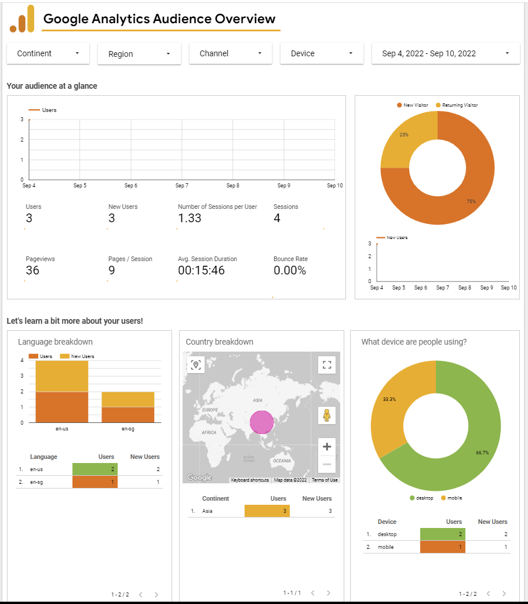
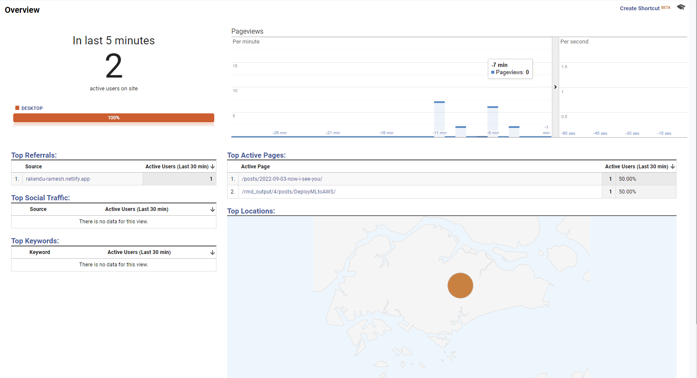

Obviously, when I started floating my Portfolio as part of my job hunt, I was curious about the footfall and that is when I came across [this](https://www.shamindras.com/posts/2019-07-31-shrotriya2019distillpt2/#step-2-setup-google-analytics-tracking) blog on implementing Google Analytics for distill articles. And here we go!

### 1. Set up Google Analytics account

Use your gmail account to login to [Google Analytics](https://analytics.google.com/analytics/web/). Create an account and a property. The property is the url of your website you want to analyse the traffic for. Create View. 

Note that you can use a combination of Universal Analytics as well as GA4 as of today (3rd Sept, 2022). Universal Analytics will be phased out by mid of next year. Hence, it is better to create a combination so that you can smoothly move to GA4.

Once the property is created, copy the Tracking Id from Admin -> Account -> Property -> Property Settings. Include this Tracking Id in your _site.yml header as 

<b>google_analytics: "UA-999999999-1"</b>

You are all set to roll. Create Custom Dashboards and Reports including widgets you find most useful for your business.

I found the following interesting. Depending on the purpose of your website, you can include data about conversion, events, campaigns,etc.

* Audience - Active Users

* Hourly/Daily/Weekly No. of users

* Sessions by Country

* Users by Time of day

* What pages do your users visit?

See a sample Report below, blank as of now.
Come back to see updates here as I explore the many features available on Google Analytics. Thanks! :)

{width=100%}

{width=100% height="700"}

{width=100%}

