

The whole idea of developing a machine learning model is to make it available to the business to use it. For this the models can be deployed on a server or cloud so that it can be accessed over your company network or the web. For this demo, we will deploy it on the cloud and link our dashboard to it.

Cloud computing has democratized the Tech world by allowing people to deploy and run their applications

- without having to purchase and manage hardware

- set up through UI easily

- Put up and pull down within minutes

- Pay only for what you use

Today, we will deploy our model that predicts Hospitalization chances on <b>AWS EC2</b>

* You can have it up and running in minutes

* It is inexpensive. (look out for next post on tips to monitor and reduce cost)

* It is ideal for demo purposes, not stable for production use.

* It is ideal for a single person team, SageMaker and Kubernetes takes more time to set up and manage.

Since we have decided how to deploy the model, let us now look at UI options:

1. Python Dash, Gradio
2. Web App using Flask
3. Tableau

We will choose Tableau to provide the UI so that there is minimal development work and also because Tableau allows Analytics Extensions which can access APIs using Tabpy. Tabpy is a python package developed and managed by Tableau. We can use this to integrate Tableau dashboard with Machine Learning model developed using python.

In short our architecture is going to be like this:

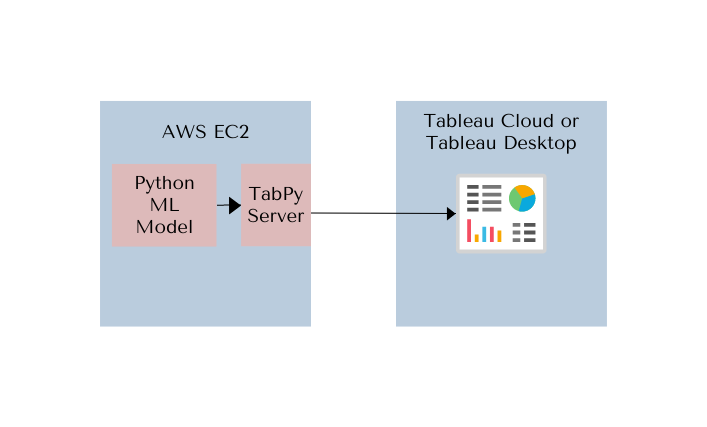

### Setting up AWS EC2 instance
Setting up an instance on AWS EC2 with basic configuration can be free but the 2GB memory may cause the tabpy instance to run out of memory. In my case, i found that there was better availability with t2.medium. Probably because my model pickle was over 1.4GB and the tabpy web service required more bandwidth.

Let us start off by launching an AWS EC2 instance using the following configuration

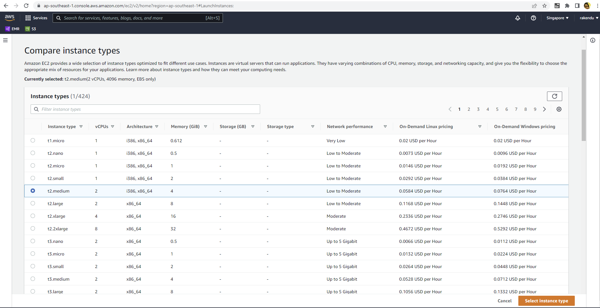

We will use ubuntu as the OS for our VM because it is considered light weight.

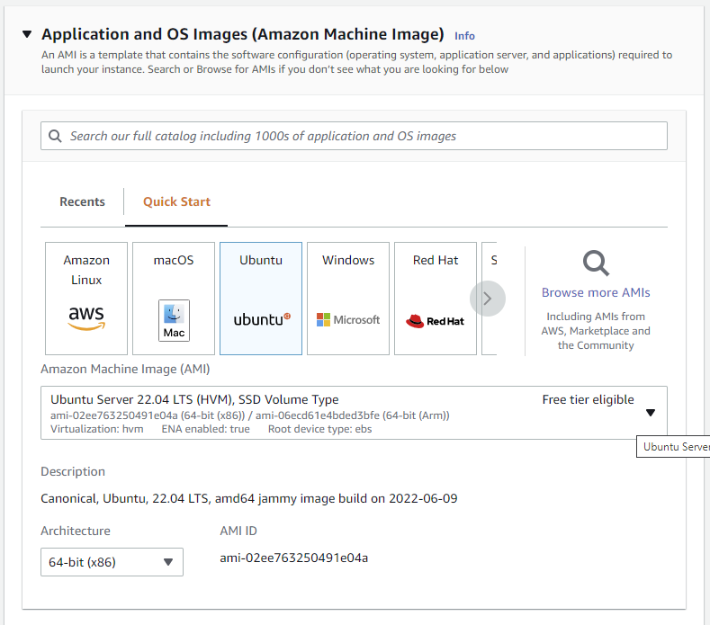{width=70%}

We will create a key pair which allows us to SSH into our vm. Remember to use the ppk key if you are going to use putty. In this case, since I will only be deploying the model on the instance, i will just use the windows command prompt. Save the key for further use.

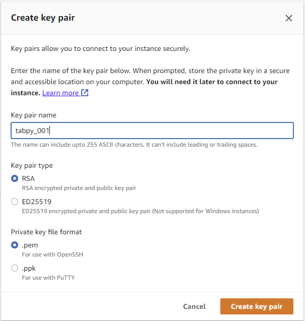{width=70%}

For security, we will set up the default port 22 to ssh into the vm and then we will need to allow the port 9004 which is the default port used by tabpy server to listen for requests. Note that here we have set up to accept requests from any IP. We can also restrict to a particular IP especially for the SSH security.

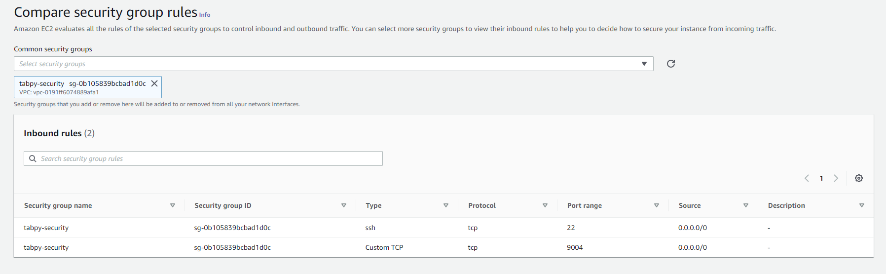

Once done with the configuration, launch the instance and wait for the status to change to running.We will be using the public IP and DNS as well as the saved key pair in further steps.

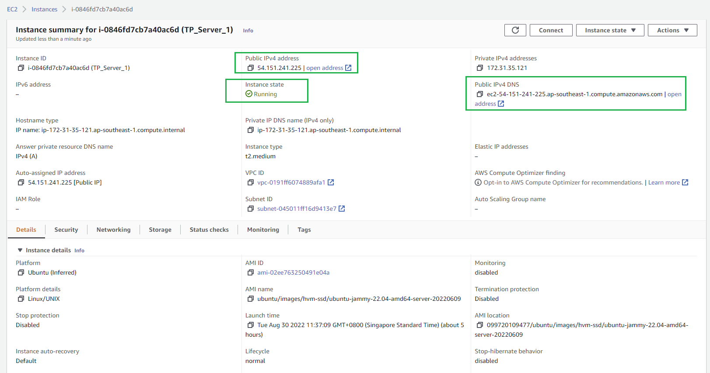

### Setting up the server

Great! Now let us SSH into the vm from windows command prompt and do the necessary installations. Below is the command for ssh, using the key name as well as the dns.

 ssh -i "tabpy_key.pem" ubuntu@ec2-54-151-241-225.ap-southeast-1.compute.amazonaws.com

Ubuntu comes with the latest version of Python.

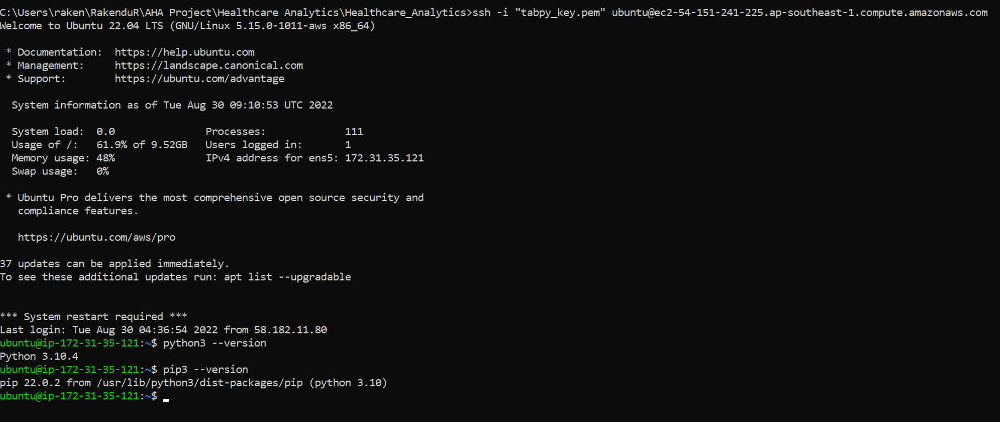

We will install pip and tabpy.But first, it is good practice to update the environment before installation. We will use the following command.

sudo apt-get update

Now let us install pip.

sudo apt-get -y install python3-pip

Now let us install tabpy.

pip3 install tabpy

After installing tabpy package, the ssh needs to be reinitiated to be able to run tabpy server.

tabpy

Now let us ssh into the vm from windows command prompt to transfer the files. Below is the command to transfer the files

scp -r -i "tabpy_001.pem" ./AWS_Files ubuntu@ec2-54-151-241-225.ap-southeast-1.compute.amazonaws.com:~/

We can see that the model pickle, pre_process pickle as well as the python script to deploy the machine learning model are moved to the vm.

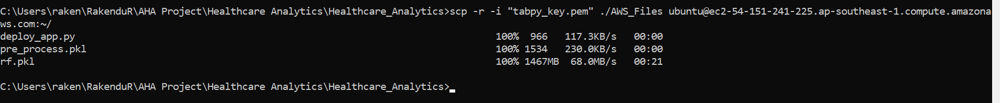
We can confirm that the files are on vm.

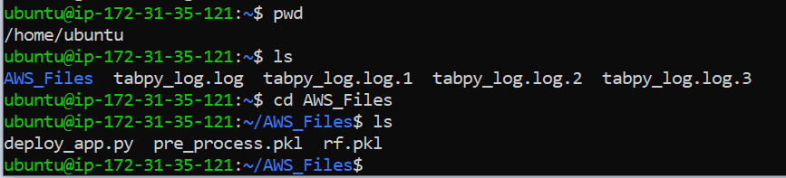{width=60%}

Let us now run the deploy_app.py using the below command

python3 deploy_app.py

The python script in deploy_app.py (below) deploys the machine learning model on the tabpy server. Please feel free to download the script from [Github](https://github.com/RakenduR/Healthcare_Analytics/tree/main/AWS_Files)

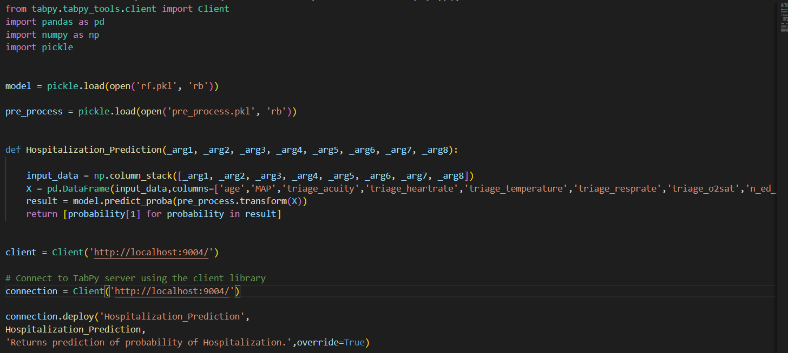{width=100%}

After running the above python script, we can verify that our function <code>Hospitalization_Prediction</code> is available on tabpy server

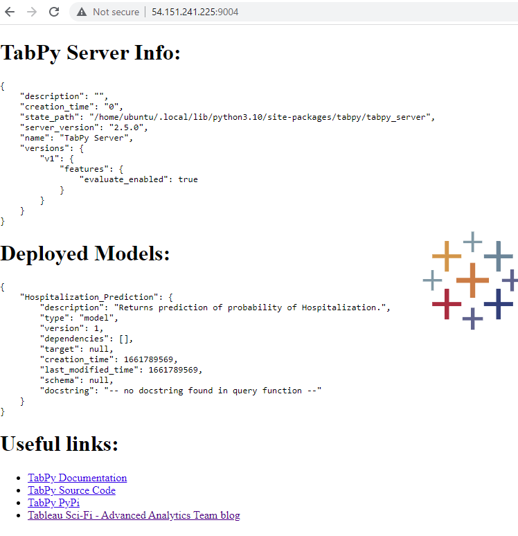{width=70%}

### Settings on Tableau dashboard

Let us now set up tableau to access the machine learning model from Tableau Desktop - Help - Settings and Performance - Manage Analytics Extension Connection as below. The Test Connection shows a successful message. Yay!

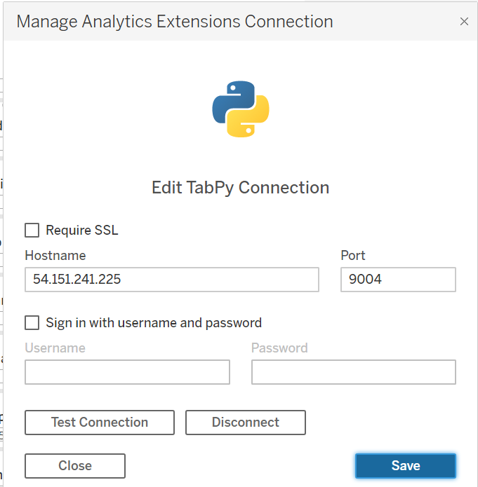{width=60%}

Let us now try out our dashboard. Click on the image below to view the video

[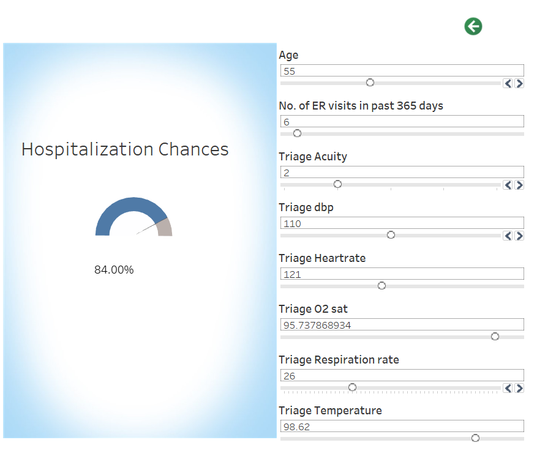{width=70%}](https://youtu.be/b9KLPyCx-y0)

### Steps to keep Tabpy running on the server

You have your dashboard up an running now, but if you close your terminal, the tabpy will get terminated. In order to keep it running when you are not connected to the server, we can install <b>tmux</b> which is a terminal multiplexer for unix like operating systems.

1. Stop Tabpy using Cntrl X, Cntrl C

2. Install tmux

sudo apt install tmux

 
3. Create new session called tabpy

tmux new -s tabpy

 
4. Start tabpy in the new session by entering 'tabpy'. So now the session is active and it can be detached by typing Cntrl B, D. Now the session is detached and the terminal can be closed, the tableau dashboard will still be able to access the ML model running on AWS EC2.

5. To get a list of all active sessions, use the following command 

tmux ls

 
6. In order to attach to an active session, use the following command

tmux attach-session -t tabpy

 
Screenshot of the terminal below for reference:

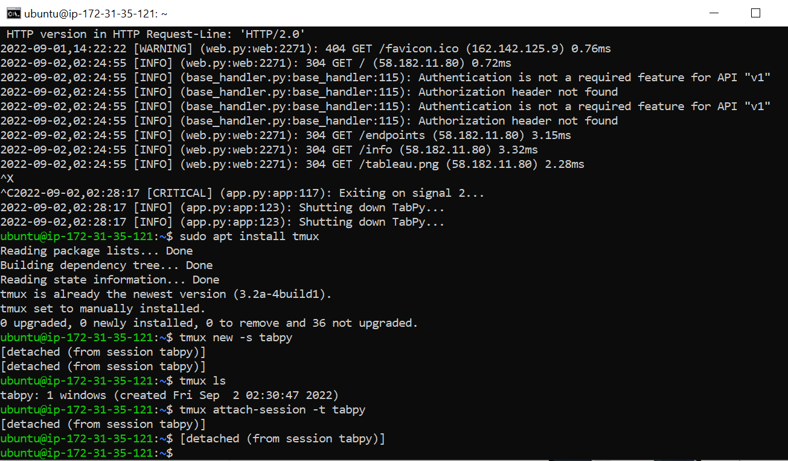

There you go! The Machine Learning model is up and running and accessible to the Tableau Dashboard from anywhere.

Stay peeled for other posts in the <b>Machine Learning Project Lifecycle</b> :)

### References

[https://www.machinelearningplus.com/deployment/deploy-ml-model-aws-ec2-instance/](https://www.machinelearningplus.com/deployment/deploy-ml-model-aws-ec2-instance/)

[https://www.youtube.com/watch?v=Xk67f45BuoA](https://www.youtube.com/watch?v=Xk67f45BuoA)

[https://www.educative.io/answers/installing-pip3-in-ubuntu](https://www.educative.io/answers/installing-pip3-in-ubuntu)