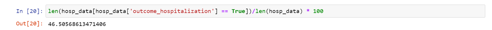

Analytics has become a crucial part of businesses. It plays a vital role in helping stakeholders make objective, accurate and confident decisions. Analytics can be of the following types, looking from the past to the future

* Descriptive analysis - <i> What happened </i>

* Diagnostic analysis - <i> Why did it happen </i>

* Predictive analysis - <i> What will happen </i>

* Prescriptive analysis - <i> How can we make it happen </i>

In this Lifecycle series, we will be following a particular use case related to healthcare. Now, more than ever before, healthcare domain is in the limelight. In the past few years, healthcare related decisions have been the make or break factor for economies and countries around the world.  We have seen how different countries took different approaches and we also saw how there is no one size fits all. These are valuable lessons that can be applied to all fields. The major lessons to be learnt are:

 - For a decision for a seemingly isolated problem, you will soon realize that there are multiple governing factors and there will be multiple factors that are directly and indirectly impacted by this decision.

 - It is important to understand not just the business problem but the entire neighborhood of it. It is important to zoom out and ask questions.For a Data Scientist, it is important to look beyond the data and understand the nook and corner of the related business.
 
### Problem Statement

The objective of a problem statement is to explain the current state, explain the desired state and identify what is required to change the current state to the desired state. Notice that the Problem Statement is purely, well, a problem statement and it does not include the solution or how we plan to achieve the desired from the current. The 'how' of it is still up for debate. It does however specify how we can measure the benefit of the solution and at what stage we can say that we have achieved our objective.

Let us formulate the problem statement for our healthcare scenario.

The Emergency Room (ER) of Hospital ABC sees hundreds of patients everyday. The ER has a process in place to triage every incoming patient. The ER Nurse will carry out some basic checks which includes measuring the blood pressure, temperature, oxygen level etc of the patient as well as ask a few questions about the age, pain level, existing conditions,etc. All these are recorded and the Nurse will assign a Triage Acuity value ranging from 1-5, 1 being the highest.

The objective of this triage process is to enable the hospital system to priorities the patients so that those in need of immediate care are not kept waiting. The patient then sees the doctor after which he may or may not get hospitalized. Now, the hospital resources are limited - limited number of beds, limited number of equipments, limited number of nurses. So we want to make sure that only those patients who are definitely in need of hospitalization are admitted. This is currently done based on the experience of the doctor. Ah, there it is, a decision based on gut feeling. While we have absolutely no doubt in the capability of our doctors, we are looking at ways to improve patient care while optimizing the utilization of hospital resources.

What are our guiding factors at this point :

1. Provide the best possible care to the patient

2. As fast as possible

3. Without inconveniencing the patient with unnecessary tests

4. Avoid hospitalization if possible, this serves 2 purposes

      - not inconvenience the patient and reduce the cost to the patient
      
      - save the hospital resources for critical patients
      
5. Avoid the patient from coming back to the ER immediately (time limit to be defined)

6. Avoid mortality

The dataset we are going to use for this case study has all details of patient visits to the ER, hospitalization details, discharge details. Let us focus on hospitalization for the purpose of this study. 

<b>For Machine Learning project, it is very critical to identify the data that is available at the point of time when our model is going to be utilized. </b>

For example, our model is to predict if a patient who has come into the ER will get hospitalized or not, what is the data that is available?

- We have the details recorded by the Triage nurse

- We have the details of the patients previous visits

What we do not have are the following:

- any details of what happens after the triage nurse has collected the data

Let us now define our Outcome column. For our case study we want to identify the records in the data set where the patient who came to the ER has been hospitalized. From the data dictionary, we know that the patients who are hospitalized are assigned a hospital admission id (hdm_id) for that particular stay. We will use this column to derive our Outcome_Hospitalization column with the following code

Let us now analyse what percentage of ER patients get hospitalized using the below code.

The hospitalization rate is 46% approx.
When a patient comes to ER, by assessing the chances of the patient getting hospitalized, the medical team can further optimize the treatment plan with the objective of avoiding hospitalization. We do understand that hospitalization cannot be always avoided even with optimized treatment. Hence, we can decide on reducing the hospitalization rate to a 35% over a period of next 3 months as our objective. In real life scenario, this decision will be taken based on discussions with the stakeholders.

It is also important to define a control. In this case, in our effort to reduce hospitalization rate, we should not end up compromising on the care. So mortality and ER Readmission will be our control.

Let us now frame our <b>Problem Statement</b>:

The current rate of Hospitalization from the ER is 46%. This results in a large proportion of the hospital facility being occupied, sometimes resulting in unavailability. The business objective is to reduce hospitalization by providing optimum care in the ER. The success criteria to judge whether the problem has been solved is, in the next 3 months, the hospitalization rate should come down to 35% without increase in mortality rate and ER Readmission rate.

We now have the business problem, which needs to be mapped to a <b>data science problem</b>.

The hospital has records of hospitalizations over a period of time. Using this data, we can train a classification model which can predict the chances that a new patient who has come to the ER will get hospitalized. This can give insight to the medical team regarding the hospitalization chances if the existing treatment protocol is followed. Based on this, the team can optimize the treatment protocol for the patient in the ER resulting in reduced hospitalization.

Now we have established a direction for our data science project. We will traverse through the rest of the project lifecycle in parts 

* Exploratory Data Analysis

* Data Wrangling

* Model Training and Evaluation

* Hyperparameter Tuning

* Dashboard Development

Stay tuned for Exploratory Data Analysis

